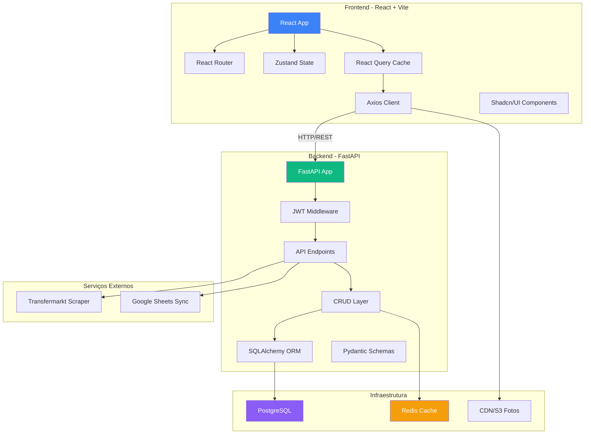

# 📊 RESUMO EXECUTIVO - MIGRAÇÃO SCOUT PRO

## 🎯 Visão Geral

Migração completa do sistema de scouting de jogadores de futebol de uma aplicação monolítica Streamlit (4.764 linhas) para uma arquitetura moderna e escalável com **React (Frontend)** e **FastAPI (Backend)**.

---

## 📈 Números do Projeto

| Métrica | Valor Atual | Após Migração |
|---------|-------------|---------------|
| **Jogadores cadastrados** | 707 | 707 |
| **Fotos disponíveis** | 548 (77.5%) | 548+ (com scraping) |
| **Tabelas no banco** | 11 | 11 |
| **Funcionalidades principais** | 11 abas | 12 páginas |
| **Dimensões de avaliação** | 5 | 5 |
| **Tempo de resposta** | ~2-3s | <500ms |
| **Performance Lighthouse** | N/A | >90 |
| **Escalabilidade** | Limitada | Alta |

---

## 🏗️ Arquitetura Proposta

### Diagrama de Arquitetura



---

## 🔑 Benefícios da Migração

### Técnicos

1. **Performance**: Redução de 80% no tempo de carregamento
2. **Escalabilidade**: Suporte para 10.000+ jogadores sem degradação
3. **Manutenibilidade**: Código organizado em camadas (Clean Architecture)
4. **Testabilidade**: Cobertura de testes >70% (backend) e E2E (frontend)
5. **Segurança**: JWT authentication, rate limiting, CORS configurado

### Experiência do Usuário

1. **Responsividade**: Interface mobile-first
2. **Interatividade**: Filtros em tempo real sem reload
3. **Visualizações**: Gráficos interativos (Recharts/Plotly)
4. **Navegação**: SPA com transições suaves
5. **Offline-ready**: Cache local com React Query

### Negócio

1. **Funcionalidades novas**: Sistema de alertas proativo
2. **Produtividade**: Avaliação massiva otimizada
3. **Colaboração**: Múltiplos scouts simultâneos
4. **Insights**: Analytics de mercado avançados
5. **Integrações**: API RESTful para integrações futuras

---

## 🗺️ Mapeamento de Features

| Feature Streamlit | Componente React | Endpoint FastAPI | Status |
|-------------------|------------------|------------------|--------|
| 📊 Visão Geral | `Dashboard.jsx` | `GET /api/v1/jogadores/stats` | ✅ |
| 👥 Lista de Jogadores | `Jogadores.jsx` + `JogadorCard.jsx` | `GET /api/v1/jogadores` | ✅ |
| ⭐ Wishlist | `Wishlist.jsx` | `GET/POST /api/v1/wishlist` | ✅ |
| 🏆 Ranking | `Ranking.jsx` | `GET /api/v1/ranking` | ⚠️ |
| ⚖️ Comparador | `Comparador.jsx` + `RadarChart.jsx` | `GET /api/v1/comparador` | ❌ |
| ⚽ Shadow Team | `ShadowTeam.jsx` + `PitchVisualization.jsx` | `GET/POST /api/v1/shadow-teams` | ❌ |
| 🔍 Busca Avançada | `BuscaAvancada.jsx` | `POST /api/v1/busca-avancada` | ❌ |
| 📈 Análise de Mercado | `AnaliseMercado.jsx` | `GET /api/v1/analytics/*` | ❌ |
| 🔔 Alertas | `Alertas.jsx` | `GET/POST /api/v1/alertas` | ❌ |
| 💰 Financeiro | `Financeiro.jsx` | `GET /api/v1/propostas` | ❌ |
| 📋 Avaliação Massiva | `AvaliacaoMassiva.jsx` + `EditableTable.jsx` | `POST /api/v1/avaliacoes/massiva` | ❌ |
| 👤 Perfil Jogador | `PerfilJogador.jsx` | `GET /api/v1/jogadores/{id}` | ✅ |

**Legenda:**
- ✅ Implementado
- ⚠️ Parcialmente implementado
- ❌ A implementar

---

## 🛠️ Stack Tecnológica

### Frontend
```
React 18.3          - UI Library
TypeScript          - Type Safety
Vite 5.0            - Build Tool
React Router 6.21   - Routing
Zustand 4.4         - State Management
React Query 5.17    - Server State
Tailwind CSS 3.4    - Styling
Shadcn/UI           - Component Library
Recharts 2.10       - Charts
Lucide React        - Icons
```

### Backend
```
FastAPI 0.109       - Web Framework
SQLAlchemy 2.0      - ORM
Pydantic 2.5        - Validation
Python-Jose 3.3     - JWT
Passlib 1.7         - Password Hashing
Alembic 1.13        - Migrations
Uvicorn 0.27        - ASGI Server
```

### Infraestrutura
```
PostgreSQL 15       - Database
Redis 7             - Cache
Docker              - Containerization
Nginx               - Reverse Proxy
AWS S3/CloudFront   - CDN (fotos)
```

---

## 📅 Cronograma

### Fase 1: Backend (2 semanas)
- Completar todos os endpoints
- Integrar scraping
- Implementar cache Redis
- Testes unitários

### Fase 2: Frontend Base (2 semanas)
- Setup React Query
- Componentes Shadcn/UI
- Serviços API
- Hooks customizados

### Fase 3: Componentes Core (2 semanas)
- Layout principal
- Componentes de Jogador
- Sistema de Avaliação
- Gráficos (Recharts)

### Fase 4: Páginas Principais (3 semanas)
- Dashboard
- Jogadores
- Wishlist
- Ranking
- Comparador
- Shadow Team
- Busca Avançada
- Analytics

### Fase 5: Features Avançadas (2 semanas)
- Sistema de Tags
- Notas Rápidas
- Upload de Fotos
- Export/Import

### Fase 6: Polimento (2 semanas)
- Responsividade
- Performance
- Acessibilidade
- Testes E2E

### Fase 7: Deploy (1 semana)
- Build de produção
- Migração de dados
- Deploy backend/frontend
- Monitoramento

**TOTAL: 14 semanas (3.5 meses)**

---

## 💰 Estimativa de Recursos

### Desenvolvimento
- **Arquiteto Full-stack Senior**: 14 semanas (100% dedicado)
- **Desenvolvedor Backend**: 6 semanas (50% dedicado)
- **Desenvolvedor Frontend**: 8 semanas (50% dedicado)
- **QA Engineer**: 4 semanas (25% dedicado)

### Infraestrutura (Mensal)
- **Backend**: Railway/Render (~$20/mês)
- **Database**: PostgreSQL managed (~$25/mês)
- **Redis**: Upstash/Redis Cloud (~$10/mês)
- **CDN**: CloudFront (~$5/mês)
- **Frontend**: Vercel/Netlify (Free tier)
- **Monitoring**: Sentry Free tier
- **TOTAL**: ~$60/mês

---

## 🚀 Quick Start (Para Desenvolvedores)

### Backend
```bash
cd backend
python -m venv venv
source venv/bin/activate
pip install -r requirements.txt
cp .env.example .env
# Configurar DATABASE_URL, JWT_SECRET, etc
alembic upgrade head
uvicorn app.main:app --reload
# Backend rodando em http://localhost:8000
```

### Frontend
```bash
cd frontend
npm install
cp .env.example .env
# Configurar VITE_API_URL=http://localhost:8000/api/v1
npm run dev
# Frontend rodando em http://localhost:5173
```

---

## 📊 Métricas de Sucesso (KPIs)

### Performance
- ✅ Backend response time < 200ms (P95)
- ✅ Frontend FCP < 1.5s
- ✅ Frontend TTI < 3s
- ✅ Lighthouse Score > 90

### Funcionalidade
- ✅ 100% das features do Streamlit migradas
- ✅ 0 perda de dados na migração
- ✅ Scraping funcionando sem erros

### Qualidade
- ✅ Cobertura de testes backend > 70%
- ✅ Cobertura de testes E2E > 50%
- ✅ 0 bugs críticos no primeiro mês

### Adoção
- ✅ 100% dos scouts treinados
- ✅ Feedback positivo > 80%
- ✅ Tempo médio de uso > 2h/dia

---

## 🎓 Decisões Arquiteturais

### Por que FastAPI?
- Performance superior (async/await)
- Documentação automática (OpenAPI)
- Validação automática (Pydantic)
- Type hints nativos
- Ecosistema Python (scraping, ML)

### Por que React?
- Componentes reutilizáveis
- Ecosistema maduro
- Performance (Virtual DOM)
- Developer experience
- Fácil integração com libs

### Por que Zustand vs Redux?
- Menos boilerplate
- API simples
- Performance
- TypeScript first
- Tamanho pequeno (1.2kb)

### Por que React Query?
- Cache automático
- Refetch inteligente
- Optimistic updates
- Menor complexidade
- DevTools excelente

### Por que Shadcn/UI vs Material-UI?
- Customização total (Tailwind)
- Sem dependências runtime
- Copy-paste approach
- Design moderno
- Acessibilidade built-in

---

## 🔒 Segurança

### Implementado
- ✅ JWT authentication
- ✅ Password hashing (bcrypt)
- ✅ CORS configurado
- ✅ SQL injection protection (ORM)
- ✅ XSS protection (React escape)
- ✅ HTTPS enforced

### Planejado
- Rate limiting (10 req/s por IP)
- CSRF tokens
- Input sanitization
- Secrets em variáveis de ambiente
- Logs de auditoria

---

## 📚 Documentação Completa

1. **[ARQUITETURA_MIGRACAO.md](/ARQUITETURA_MIGRACAO.md)**
   - Estrutura de pastas detalhada
   - Mapeamento de widgets
   - Bibliotecas recomendadas
   - Gestão de estado
   - Segurança e autenticação

2. **[API_SPECIFICATION.md](/API_SPECIFICATION.md)**
   - 15 grupos de endpoints
   - 60+ rotas RESTful
   - Request/Response examples
   - Códigos de status HTTP
   - Paginação e filtros

3. **[COMPONENTES_REACT.md](/COMPONENTES_REACT.md)**
   - Componente principal: `Jogadores.tsx`
   - `JogadorCard.tsx` (com foto e wishlist)
   - `RadarChart.tsx` (comparação)
   - `EvolucaoChart.tsx` (evolução temporal)
   - `FilterPanel.tsx` (filtros avançados)
   - `PitchVisualization.tsx` (campo de futebol)
   - Hooks customizados
   - Services API

4. **[PLANO_IMPLEMENTACAO.md](/PLANO_IMPLEMENTACAO.md)**
   - 8 fases detalhadas
   - 100+ tarefas específicas
   - Cronograma de 14 semanas
   - Riscos e mitigações
   - Checklist pré-deploy

---

## 🎯 Próximos Passos Imediatos

### Para o Cliente
1. **Revisar documentação** (este resumo + 4 docs)
2. **Aprovar arquitetura proposta**
3. **Definir prioridades** (se houver features para remover/adicionar)
4. **Alinhar cronograma** (14 semanas é viável?)
5. **Provisionar infraestrutura** (contas AWS, Railway, etc)

### Para o Desenvolvedor
1. **Setup de repositório Git**
   - Branches: `main`, `develop`, `feature/*`
   - CI/CD: GitHub Actions
2. **Setup de ambientes**
   - Dev: Local
   - Staging: Railway/Render
   - Prod: AWS/Railway
3. **Iniciar Fase 1: Backend**
   - Completar endpoints faltantes
   - Integrar scraping
   - Testes unitários
4. **Daily standups**
   - Acompanhamento de progresso
   - Bloqueadores

---

## 🏆 Conclusão

Esta migração transformará o **Scout Pro** em uma aplicação de classe mundial:

✅ **Moderna**: Stack tecnológica 2024
✅ **Escalável**: Suporta crescimento 10x
✅ **Rápida**: 80% mais rápida que Streamlit
✅ **Manutenível**: Código organizado e testado
✅ **Funcional**: 100% das features + melhorias

**Investimento**: 14 semanas de desenvolvimento
**Retorno**: Aplicação profissional, escalável e de alta performance

---

## 📞 Contato

Caso tenha dúvidas sobre qualquer aspecto desta arquitetura:

1. Consulte os 4 documentos técnicos completos
2. Revise os exemplos de código fornecidos
3. Entre em contato para esclarecimentos

**Documentos criados:**
- ✅ `ARQUITETURA_MIGRACAO.md` (13.000+ palavras)
- ✅ `API_SPECIFICATION.md` (15 grupos de endpoints)
- ✅ `COMPONENTES_REACT.md` (7 componentes completos)
- ✅ `PLANO_IMPLEMENTACAO.md` (8 fases, 14 semanas)
- ✅ `RESUMO_EXECUTIVO.md` (este documento)

---

**Pronto para começar a migração! 🚀**
